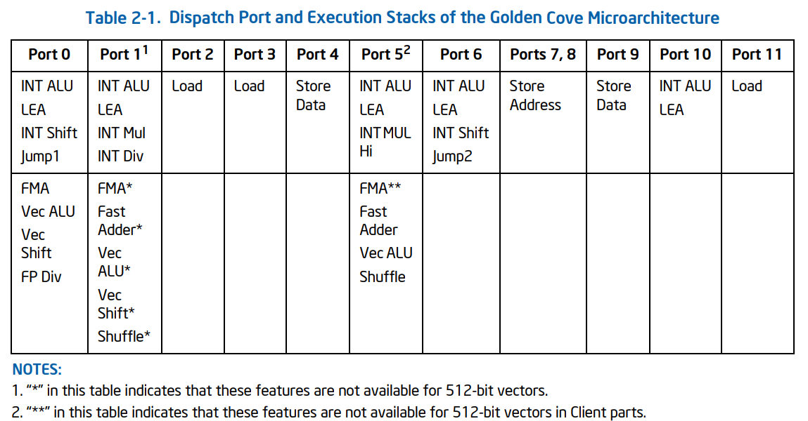
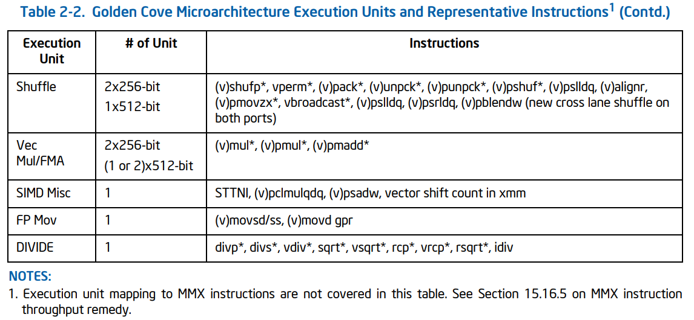

# Intel Software Optimization Manual

* https://www.intel.com/content/www/us/en/developer/articles/technical/intel-sdm.html

`248966-046A-software-optimization-manual`

## Chapter 2

### 2.1 SAPPHIRE RAPIDS microarchitecture

### 2.2 ALDER LAKE performance hybrid architecture

Alder Lake は hybrid なシステム

* the Golden Cove perfomant cores
* the Gracemont efficient Atom cores

#### 2.2.1 12th

* 8 Performance cores (P-cores)
* 8 Efficient cores (E-cores)
* 3MB Last Level Cache (LLC) per IDI module
    * IDI module = 1 P-core or 4 E-cores
* symmetric ISA across different core types

#### 2.2.2 Hybrid scheduling

Intel Thread Director はソフトウェアをリアルタイムで監視し、OSにスレッドスケジューリングのためのヒントを与える。

P-core と E-core からなる hybrid なシステムでのスケジューリングはむつかしい。
たとえば、命令ごとのパフォーマンスの比が異なる：highly vectorized floating-point code > scalar integer code。

Intel Thread Director は4つのスレッドクラスを定義する。

1. Class 0: Non-vectorized integer or floting-point code.
2. Class 1: Integer or floating-point vectorized code, excluding Intel Deep Learning Boost (Intel DL Boost) code.
3. Class 2: Intel DL Boost code.
   * これが一クラスになっているの面白い
4. Class 3: Pause (spin-wait) dominated code.

#### 2.2.3 Recommendations for Application Developers

* スレッドとプロセッサを結びつけない (このスレッドは P-core で、とかしない)
    * OS に最適化の余地を与える
* active spin-waits を lightweight waits に置き換える
    * `UNWAIT/TPAUSE` と使うのが望ましい
* Windows Media Foundation framework を使う
* Windows IrqPolicyMachineDefault policy

### 2.3 Golden Cove microarchitecure

Golden Cove microarchitecture は Ice Lake microarchitecture の後継者。

#### 2.3.1 Overview

##### 2.3.1.1 Frontend

feed the wider and deeper out-of-order core.

* Legacy decode pipeline
    * fetch 32 bytes per cycle.
* デコーダーは6つ
    * decode 6 instructions per cycle.
* micro-op cache, its bandwidth
    * deliver 8 micro-ops per cycle.
* Improved branch prediction

##### 2.3.1.2 Out-of-Order and Execution Engines

表2-1は OOO エンジンが命令をポートにディスパッチする方法のまとめ。

表2-2は実行ユニットとそのユニットを使用する命令の代表例のリスト。

表2-3は producer/consumer 命令でのバイパス遅延のサイクル数を示す。

