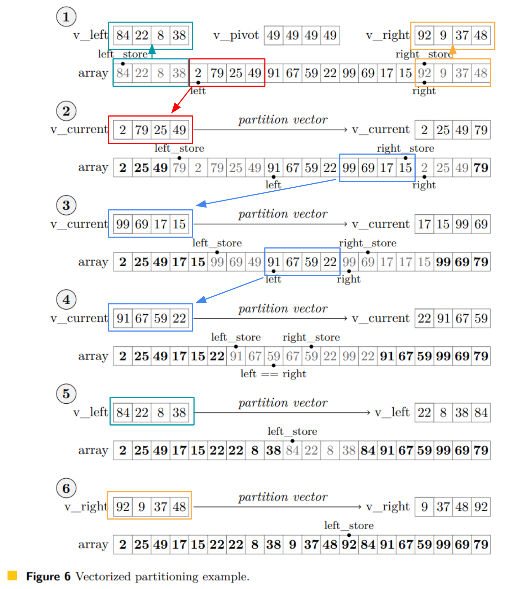

# SIMD sort

* [A Novel Hybrid Quicksort Algorithm Vectorized using AVX-512 on Intel Skylake](https://arxiv.org/abs/1704.08579)
    * 2017年
    * AVX512
* [fast-and-robust](https://github.com/simd-sorting/fast-and-robust)
    * 2021年
    * AVX2
    * [Fast and Robust Vectorized In-Place Sorting of Primitive Types](https://drops.dagstuhl.de/opus/volltexte/2021/13775/) の実装
    * 小～中規模な配列のソートにはソーティングネットワークを使う
    * 大規模な配列のソートにはクイックソートを使う
    * Quicksort の戦略が上よりも優れている（たくさんレジスタを使って高速に。）
* [x86-simd-sort](https://github.com/intel/x86-simd-sort)
    * 2022年
    * AVX512
    * numpy にマージされた高速なSIMD sort
        * [PR: ENH: Vectorize quicksort for 16-bit and 64-bit dtype using AVX512](https://github.com/numpy/numpy/pull/22315)
    * 上二つを引用していて、おそらくアルゴリズムもそれほど変わらないはず
        * 見た限りfast-and-robustに類似
        * pivotの戦略がちょっと異なる

## fast-and-robust

### ソーティングネットワーク

小規模の配列($n \le 128$)と中規模の配列($128 < n \le 512$)をソーティングネットワークでソートする。

* 小規模⇒Bitonic sort
* 中規模⇒Irregular sorting network

### クイックソート

fast-and-robustのFigure 6がわかりやすい（一部改変して引用）。

## SIMD instructions

### 256

* Setter
    * `_mm256_set1_epi32`
    * `_mm256_setr_epi32x`
    * `_mm256_setr_epi64x`
    * `_mm256_loadu_si256` : loader
    * `_mm256_maskload_epi32`
    * `_mm256_i32gather_epi32` : gather
* Getter
    * `_mm256_storeu_si256`
    * `_mm256_maskstore_epi32`
    * `_mm256_extract_epi32`
* Basic calculus
    * `_mm256_srli_epi64`
    * `_mm256_add_epi32`
    * `_mm256_add_epi64`
    * `_mm256_sub_epi64`
    * `_mm256_mul_epu32`
    * `_mm256_min_epi32`
    * `_mm256_max_epi32`
    * `_mm256_cmpgt_epi32` : compare
* Permutation / Shuffle
    * `_mm256_permutevar8x32_epi32` : permutation
        * pivot操作で使う
        * 256(=2^8)通りごとにどうpermuteするかあらかじめテーブルでもっておく
            * `permutation_masks`
    * `_mm256_shuffle_epi32`
    * `_mm256_shuffle_ps`
* Tricky
    * `_mm256_castsi256_ps` , `_mm256_movemask_ps` 
        * compareで得たmaskを数値に変換するのに用いる
        * compareで出来るmaskは計2^8=256通り
        * その値に写像する
    * `_mm256_blendv_epi8` : 二つのvecをブレンドして新しいvecを作る
    * `_mm256_blend_epi32`
    * `_mm256_unpacklo_epi32`
    * `_mm256_unpackhi_epi32`
    
### 512

## 参考文献

* [SIMDプログラミング入門（AVX-512から始める編）](https://qiita.com/saka1_p/items/72c7755086ec985cade6)
* [AVX/AVX2による整数のShuffleとPermute](https://qiita.com/fukushima1981/items/6a462284769fe1ad62a3)
* [Intel Intrinsics SIMDのシャッフル系操作まとめ](https://qiita.com/stanaka2/items/a88d257661a22e15b8f0)
